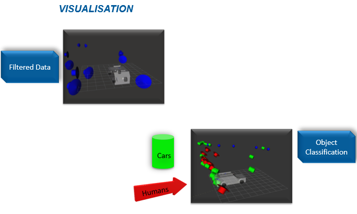

# V2X CPM Perception & Visualization Pipeline

A ROS-based pipeline that ingests radar perception data (via rosbag files or a live PDK topic), parses it as **ETSI ITS Collective Perception Messages (CPM)**, filters out false radar detections, and visualizes the cleaned results in RViz with distinct object markers.

<p align="center">
  
  <br/>
  <em>Left: unfiltered detections. Right: filtered output classified as cars (green) and pedestrians (red), with clean markers in RViz.</em>
</p>

---

## Overview

Automotive radar sensors are noisy: they routinely report **false positives** (phantom objects that aren't there) and **false negatives** (missed real objects), especially in cluttered or multipath-heavy environments. This project builds a pipeline that:

1. **Reads** raw perception data collected from a test vehicle's radar, via rosbag recordings or the live `/pdk/tracking` topic (Perception Development Kit)
2. **Parses** it according to the **ETSI ITS CPM standard**, using ~130 custom ROS message definitions (`pdk_ros_msgs`)
3. **Filters** detections using rule-based thresholds — **object confidence score > 0.9** and **distance < 50m** — to reject false positives while keeping valid nearby objects
4. **Visualizes** the cleaned object list in RViz, rendering distinct markers per object class (**cars** and **pedestrians**) against a vehicle model for spatial reference

This was built as part of a 4-stage V2X (Vehicle-to-Everything) group project: Data Collection → **Subscribing & Filtering** → **Visualization** → Transferring (to Cohda Wireless MK5 On-Board Units for V2X communication). This repository covers the **filtering and visualization** stages.

## Architecture

```
    Test vehicle radar ──► /pdk/tracking topic ──┐
                                                 │
   rosbag playback ───────────────────────────►  │
                                                 ▼
                                         ┌───────────────────┐
                                         │    pdk_ros        │
                                         │ (ROS node, Python)│──► filtered objects ──► RViz markers
                                         │ score > 0.9       │                           │
                                         │ distance < 50m    │                           ▼
                                         └───────────────────┘                  ┌────────────────────┐
                                                                                │   ros_rviz_car     │
                                                                                │ (ego vehicle model)│
                                                                                └────────────────────┘
```

- **`pdk_ros/`** — Core processing package. Defines ~130 CPM-aligned ROS messages (`pdk_ros_msgs`) and a Python ROS node (`pdk_tracking_filter_and_visualization.py`) that subscribes to `/pdk/tracking`, applies the confidence/distance filter, classifies objects (car vs. pedestrian), and republishes RViz markers.
- **`ros_rviz_car/`** — Provides the ego-vehicle URDF/model so filtered detections can be visualized in context in RViz, alongside the TF tree (see `frames.pdf`).

## Filtering Logic

Raw CPM detections are rejected or kept based on:
- **Object confidence score > 0.9** — detections below this threshold are dropped as likely false positives
- **Distance < 50m** — detections beyond this range are filtered out as out-of-relevance for the ego vehicle

Built as a ROS Melodic node running on Ubuntu, subscribing to the Perception Development Kit's `/pdk/tracking` topic.

## Repository Structure

```
.
├── src/
│   ├── pdk_ros/
│   │   └── pdk_ros_msgs/
│   │       ├── msg/                                    # ~130 ETSI ITS CPM-aligned message definitions
│   │       └── src/
│   │           ├── pdk_tracking_filter_and_visualization.py   # filtering + RViz marker publishing
│   │           └── team1.py
│   └── ros_rviz_car/
│       ├── launch/
│       │   └── simple_display.launch
│       ├── model/                                      # car.urdf, car.dae, and variants
│       ├── frames.pdf                                  # TF tree diagram
│       ├── CMakeLists.txt
│       └── package.xml
└── README.md
```

## Getting Started

### Prerequisites
- ROS Melodic (Ubuntu)
- Python 2.7 (Melodic's default) or adjust node for Python 3 if ported
- A sample rosbag with radar/CPM data, or access to a live `/pdk/tracking` topic

### Build
```bash
git clone https://github.com/Kaustubh3197/v2x-cpm-perception.git
cd v2x-cpm-perception
catkin_make          # or colcon build for ROS2
source devel/setup.bash
```

### Run
```bash
# Launch the filtering + visualization node
rosrun pdk_ros_msgs pdk_tracking_filter_and_visualization.py

# In another terminal, launch RViz with the vehicle model
roslaunch ros_rviz_car simple_display.launch

# Play back a sample rosbag
rosbag play path/to/sample.bag
```

## Project Presentation

This work was completed as part of a university group project on Car2X communication (THI, SS2023), where our team (Team 4) was responsible for the PDK-based perception, filtering, and visualization pipeline within the larger V2X system.

📄 [Full team presentation](docs/V2X_Team4_Presentation.pdf) — includes V2X background, project architecture, and details on data collection, filtering, and visualization.

## Tech Stack

`ROS Melodic` · `Python` · `RViz` · `ETSI ITS CPM` · `rosbag` · `Ubuntu` · `Perception Development Kit (PDK)`
